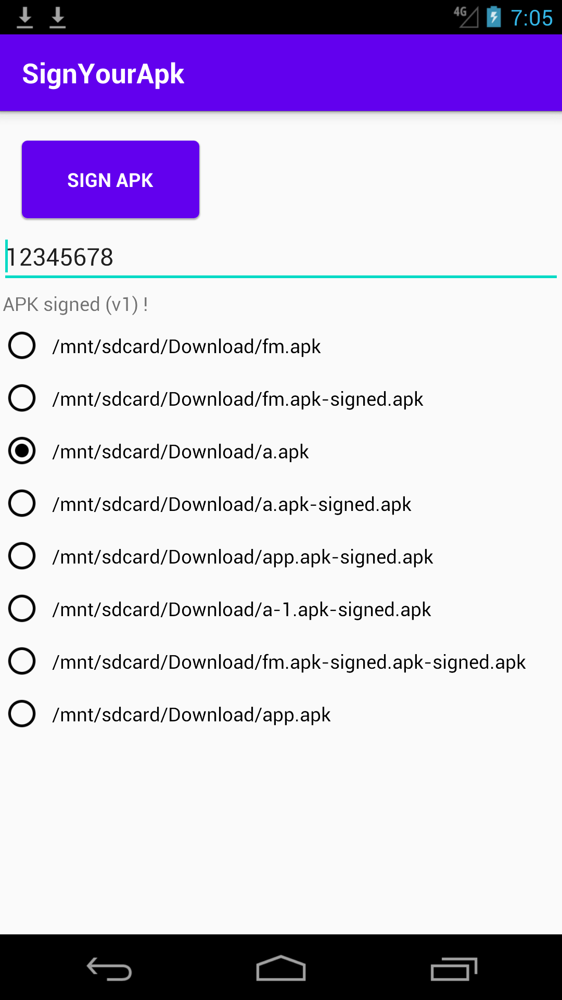

# SignYourApk

## apksigner tool Android App

Original source code :

https://github.com/fornwall/apksigner/

https://deb.debian.org/debian/pool/main/a/android-platform-tools-apksig/android-platform-tools-apksig_31.0.2.orig.tar.gz

https://www.bouncycastle.org/download/bouncy-castle-java/

### License

See individual files for license information.

-----------------
"C:\Program Files\Android\Android Studio\jbr\bin\keytool.exe"  -genkey -keyalg RSA -alias cert -keystore cert.bks -storepass 12345678 -validity 36000 -storetype BKS  -provider org.bouncycastle.jce.provider.BouncyCastleProvider -providerpath Downloads\bcprov-jdk18on-1.78.1.jar

----------------

python -m http.server --cgi 80

